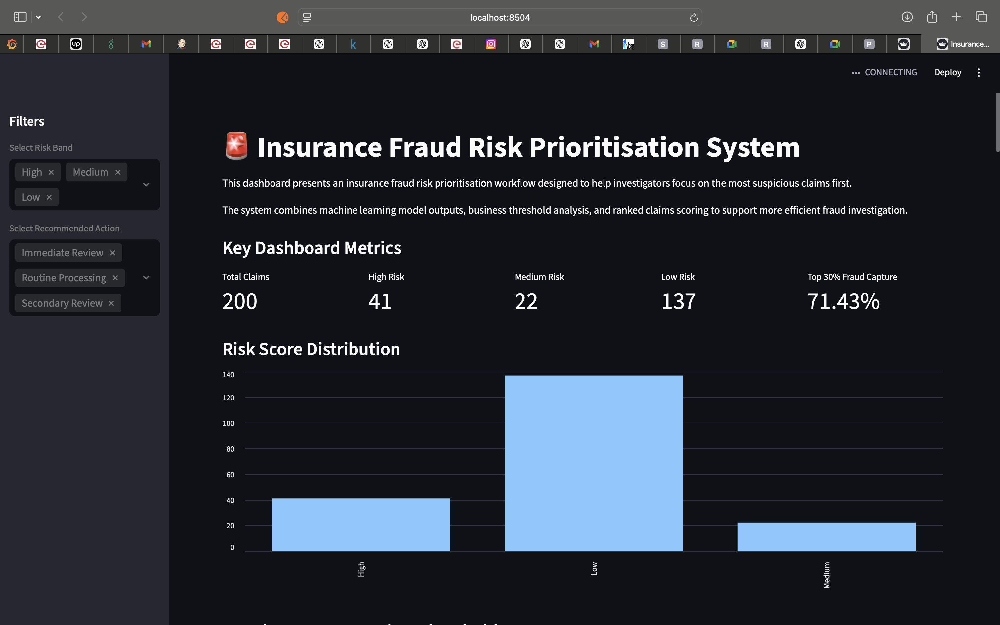

# 🚨 Insurance Fraud Risk Prioritisation System

## 📌 Project Overview

This project simulates a fraud risk prioritisation workflow relevant to regulated insurance environments, with UK job-market framing around fraud analytics, risk scoring, investigation prioritisation, and workload reduction.

It goes beyond model building by focusing on:
- Risk-based prioritisation of claims
- Business decision support
- Trade-off analysis between fraud detection and operational workload
- Model explainability for investigation teams

The system is designed to reflect how fraud analytics is implemented in production environments.

---

## 🎯 Business Problem
Insurance companies process thousands of claims, but investigation resources are limited. Reviewing every claim manually is inefficient and leads to:

- missed fraud cases,
- wasted effort on low-risk claims,
- delayed investigation workflows.

This project addresses that problem by transforming fraud detection into a **decision-support system** that prioritises claims based on risk.

---

## 💡 Solution Approach

The system combines data processing, machine learning, and business logic to create a practical fraud prioritisation workflow.

### 🔹 Key Capabilities
- Predicts fraud likelihood for each claim  
- Converts predictions into a **0–100 risk score**  
- Groups claims into **Low / Medium / High risk bands**  
- Ranks claims for investigation priority  
- Measures **fraud capture vs workload trade-offs**  
- Provides a **dashboard for business users**

---

## ⚙️ Tech Stack

- **Python** (Pandas, NumPy)
- **Scikit-learn** (Logistic Regression, Random Forest, Gradient Boosting)
- **Matplotlib** (visualisation)
- **Streamlit** (dashboard)
- **SHAP** (model explainability)
- **Joblib** (model persistence)
- **SQLite** (SQL analysis)

---

## 📊 Model Development

### Models Trained
- Logistic Regression
- Random Forest
- Gradient Boosting

### Model Selection
- Logistic Regression selected for:
  - best **F1-score balance**
  - higher **recall** (important for fraud detection)
  - interpretability

- Random Forest used for:
  - strong **ranking capability (ROC-AUC)**

### Model Used in Risk Scoring Workflow
The saved project pipeline (`models/fraud_model_pipeline.pkl`) is the model used for the risk scoring outputs and dashboard workflows.

---

## 📈 Business Evaluation

The model was evaluated not just by accuracy, but by **business impact**:

| Review Threshold | Fraud Capture | Workload Reduction |
|-----------------|-------------|--------------------|
| Top 10%         | 20.4%       | 90%                |
| Top 20%         | 51.0%       | 80%                |
| Top 30%         | 71.4%       | 70%                |

---

## 💼 Business Impact
This system helps insurance companies prioritise high-risk claims for investigation.

- High-risk claims: ~63% fraud rate
- Medium-risk claims: ~45% fraud rate
- Low-risk claims: ~9% fraud rate

This shows that fraud is heavily concentrated in high-risk segments, allowing investigators to focus on the most impactful cases.

The system significantly reduces workload by enabling teams to prioritise fewer, higher-risk claims instead of reviewing all claims equally.

---

## 🧠 Risk Scoring System

### Risk Bands
- **High Risk** → Immediate Review  
- **Medium Risk** → Secondary Review  
- **Low Risk** → Monitor  

Each claim is:
- scored (0–100),
- ranked,
- assigned an investigation action.

---

## 📊 Dashboard (Streamlit)

The project includes an interactive dashboard that allows users to:

- view prioritised claims
- filter by risk band and action
- analyse fraud capture performance
- compare model performance
- download investigation-ready data

### 🔍 Dashboard Preview


---

## 🔍 Explainability

The system includes model explainability through SHAP:

- `reports/figures/shap_feature_importance.png`
- `reports/figures/shap_summary_plot.png`

---

## 🗂️ Project Structure
```text
Insurance-Fraud-Project/
├── app.py
├── requirements.txt
├── README.md
├── data/
│   ├── raw/
│   └── processed/
├── database/
│   └── insurance_fraud.db
├── docs/
│   ├── business_problem.md
│   ├── data_understanding.md
│   ├── eda_insights.md
│   ├── explainability.md
│   ├── modeling_summary.md
│   └── risk_scoring_summary.md
├── models/
│   └── fraud_model_pipeline.pkl
├── notebooks/
│   ├── 01_data_exploration.ipynb
│   ├── 02_feature_engineering.ipynb
│   ├── 03_model_training.ipynb
│   └── 04_risk_scoring_and_dashboard_prep.ipynb
├── reports/
│   ├── business_metrics.csv
│   ├── business_summary.md
│   ├── dashboard_summary.csv
│   ├── evaluation_prioritised_claims.csv
│   ├── final_prioritised_claims.csv
│   ├── full_prioritised_claims.csv
│   ├── model_results.csv
│   ├── ranked_claims.csv
│   ├── risk_band_summary.csv
│   ├── top_20_priority_claims.csv
│   ├── figures/
│   └── sql_outputs/
└── src/
    ├── create_insurance_database.py
    └── run_sql_analysis.py
```

---

## 🚀 How to Run the Project

### 1. Clone the repository
```bash
git clone https://github.com/Eniola1cc/Insurance-Fraud-Project.git
cd Insurance-Fraud-Project
```

### 2. Create and activate a virtual environment (recommended)
```bash
python -m venv .venv
source .venv/bin/activate
```

### 3. Install dependencies
```bash
pip install -r requirements.txt
```

### 4. Launch dashboard
```bash
streamlit run app.py
```

---

## 🔁 Reproducible Workflow

1. **Explore data**: `notebooks/01_data_exploration.ipynb`  
2. **Engineer features**: `notebooks/02_feature_engineering.ipynb`  
3. **Train and evaluate models**: `notebooks/03_model_training.ipynb`  
4. **Generate ranked/risk-scored outputs**: `notebooks/04_risk_scoring_and_dashboard_prep.ipynb`  
5. **Run SQL analysis outputs** (optional):
   ```bash
   python src/create_insurance_database.py
   python src/run_sql_analysis.py
   ```
6. **Open dashboard** with `streamlit run app.py`

---

## 📚 Additional Documentation

- `docs/business_problem.md`
- `docs/data_understanding.md`
- `docs/eda_insights.md`
- `docs/modeling_summary.md`
- `docs/risk_scoring_summary.md`
- `docs/explainability.md`
- `reports/business_summary.md`
